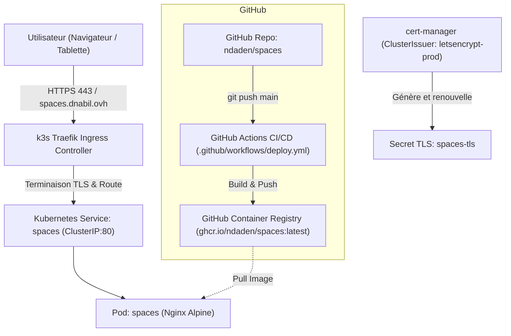

# Spécification Technique & Conception : Déploiement k3s et Évolution de Spaces

**Date :** 2026-09-25  
**Auteur :** Antigravity (Google DeepMind) & Nabil  
**Projet :** Spaces — Outil d'esquisse et de programmation architecturale pour chantier  
**Domaine cible :** `spaces.dnabil.ovh`  
**Plateforme d'hébergement :** VPS k3s (Traefik + cert-manager `letsencrypt-prod`)  
**Registre d'images :** GitHub Container Registry (`ghcr.io/ndaden/spaces`)  

---

## 1. Contexte et Objectifs

### 1.1 Contexte
L'application **Spaces** est actuellement un outil d'esquisse rapide de plans d'étages et de programmation architecturale conçu pour fonctionner directement dans le navigateur, 100% hors-ligne. 
L'ensemble de l'application réside actuellement dans un unique fichier `index.html` (6 363 lignes) comprenant balisage HTML, styles CSS, scripts JS, icônes SVG et logos en base64, sans aucune dépendance externe.

### 1.2 Objectifs
1. **Opérationnel immédiat :**
   - Mettre en place un serveur web de production conteneurisé (Nginx Alpine).
   - Définir l'infrastructure Kubernetes déclarative pour **k3s** avec Ingress Traefik et TLS automatisé Let's Encrypt pour l'URL **`spaces.dnabil.ovh`**.
   - Initialiser le dépôt Git et créer le remote GitHub `ndaden/spaces`.
   - Mettre en place un pipeline CI/CD GitHub Actions pour automatiser le build et la publication sur `ghcr.io`.
2. **Vision et Feuille de Route d'Évolution (Chantier / Tablette First) :**
   - Formaliser l'architecture modulaire cible (Vite + TypeScript + PWA).
   - Définir le découpage des 6 363 lignes monolithiques en modules réutilisables et testables.
   - Spécifier le moteur graphique hybride (SVG pour les plans/surfaces + Canvas superposé pour le stylet/annotations à main levée).
   - Spécifier la gestion hors-ligne complète (PWA Service Worker) et la prise de photos sur site épinglées sur le plan.

---

## 2. Architecture de Déploiement Immédiat (k3s VPS)

### 2.1 Diagramme d'Infrastructure



### 2.2 Conteneurisation Web : `Dockerfile` & `nginx.conf`
- **Base image** : `nginx:1.27-alpine` (extrêmement légère : ~20 Mo, rapide et sécurisée).
- **Configuration Nginx (`nginx.conf`)** :
  - Port d'écoute : `80`
  - Compression Gzip activée pour `text/html`, `text/css`, `application/javascript`, `image/svg+xml`, `application/json`.
  - En-têtes de sécurité : `X-Content-Type-Options: nosniff`, `X-Frame-Options: SAMEORIGIN`, `Referrer-Policy: strict-origin-when-cross-origin`.
  - Gestion du cache :
    - `index.html` : `Cache-Control: no-cache, must-revalidate` (pour garantir que les mises à jour sont immédiatement visibles).
    - Assets statiques (`logo/`, etc.) : `Cache-Control: public, max-age=86400`.
  - Endpoint de santé : `/healthz` renvoyant un statut HTTP 200 pour les probes Kubernetes.

### 2.3 Manifests Kubernetes (`k8s/`)

1. **Namespace (`k8s/namespace.yaml`)** :
   - Nom : `spaces` (isolation propre des workloads).
2. **Deployment (`k8s/deployment.yaml`)** :
   - Nom : `spaces-deployment`
   - Replicas : 1
   - Image : `ghcr.io/ndaden/spaces:latest`
   - Probes :
     - `readinessProbe` : HTTP GET `/healthz` port 80 (initialDelaySeconds: 2, periodSeconds: 5)
     - `livenessProbe` : HTTP GET `/healthz` port 80 (initialDelaySeconds: 5, periodSeconds: 10)
   - Resources :
     - Requests : 10m CPU / 16Mi RAM
     - Limits : 100m CPU / 64Mi RAM
3. **Service (`k8s/service.yaml`)** :
   - Type : `ClusterIP`
   - Ports : 80 -> 80
4. **Ingress (`k8s/ingress.yaml`)** :
   - Ingress class : `traefik`
   - Annotations :
     - `cert-manager.io/cluster-issuer: letsencrypt-prod`
     - `traefik.ingress.kubernetes.io/router.entrypoints: websecure`
     - `traefik.ingress.kubernetes.io/router.tls: "true"`
   - Hôte : `spaces.dnabil.ovh`
   - TLS Secret : `spaces-tls`
5. **Kustomization (`k8s/kustomization.yaml`)** :
   - Agrégation déclarative pour déploiement en une seule commande : `kubectl apply -k k8s/`.

### 2.4 CI/CD GitHub Actions (`.github/workflows/deploy.yml`)
- Déclenché sur : `push` sur la branche `main` et manuellement via `workflow_dispatch`.
- Permissions : `contents: read`, `packages: write`.
- Actions :
  - `docker/setup-buildx-action`
  - `docker/login-action` vers `ghcr.io` avec `secrets.GITHUB_TOKEN`
  - Build et push multi-tags : `ghcr.io/ndaden/spaces:latest` et `ghcr.io/ndaden/spaces:${{ github.sha }}`.

---

## 3. Architecture Cible pour l'Évolution (PWA & Tablette Chantier)

### 3.1 Pourquoi cette cible ?
Sur un chantier :
- La connectivité est intermittente ou absente (sous-sols, gros œuvre).
- La manipulation se fait debout ou en mouvement, souvent avec une seule main ou avec un stylet (iPad / Apple Pencil / S-Pen).
- Le besoin de documenter visuellement la réalité du terrain impose d'attacher des photos géoréférencées aux pièces ou aux points Lambert.

### 3.2 Découpage Modulaire du Monolithe (6 363 lignes)

```
src/
├── core/
│   ├── geometry/           # Moteur géométrique pur (zéro DOM)
│   │   ├── bounds.ts       # Rectangles, intersections, Liang-Barsky
│   │   ├── push.ts         # Déplacement de cloisons et répulsion de pièces mitoyennes
│   │   ├── polygon.ts      # Union de polygones et calcul de sommets
│   │   ├── snap.ts         # Magnétisme (grille x/y, arêtes, points)
│   │   └── units.ts        # Ratios de surfaces, conversion mètres/pixels
│   ├── store/              # État applicatif & persistance
│   │   ├── state.ts        # Modèle de données (Levels, Spaces, Points, Lines)
│   │   ├── history.ts      # Undo / Redo immutable
│   │   └── storage.ts      # IndexedDB / Dexie.js (offline-first)
│   └── io/                 # Import / Export
│       ├── lambert.ts      # Projection et import coordonnées Lambert CSV
│       ├── csv-program.ts  # Import liste de surfaces et programmation
│       ├── svg-export.ts   # Générateur de plan SVG autonome
│       └── png-export.ts   # Rendu raster avec métadonnées physiques pHYs (DPI)
├── ui/
│   ├── canvas/             # Moteur de rendu graphique hybride
│   │   ├── SvgPlan.tsx     # Calque SVG principal (pièces, murs, cotes)
│   │   ├── InkCanvas.tsx   # Calque Canvas superposé (annotations stylet / Apple Pencil)
│   │   └── Viewport.ts     # Pan, zoom, rotation, gestion des PointerEvents
│   ├── components/         # Interface tactile
│   │   ├── PhoneShell.tsx  # Accordéons et bottom-sheet rétractables
│   │   ├── LevelBar.tsx    # Sélecteur d'étage adapté au pouce
│   │   ├── ToolPalette.tsx # Outils (Select, Push, Space, Point, Line, Rotate)
│   │   └── PhotoModal.tsx  # Prise de photo caméra et épinglage sur plan
│   └── pwa/
│       ├── sw.ts           # Service Worker Workbox (mise en cache totale offline)
│       └── manifest.json   # Déclaration Web App plein écran
```

### 3.3 Moteur Graphique Hybride (SVG + Canvas)
- **Calque 1 (Fond & Grille)** : Grille orientable et magnétique (rendu SVG ou Canvas).
- **Calque 2 (Plan Architectural - SVG)** :
  - Les pièces, cloisons, labels et cotes restent en SVG DOM.
  - Avantage : Niveaux de zoom infinis sans pixellisation, export vectoriel fidèle 1:1, sélection d'éléments native.
- **Calque 3 (Annotations Chantier / Stylet - Canvas 2D/WebGL)** :
  - Un `<canvas>` transparent superposé exactement calé sur le viewport.
  - Capture de la pression (`e.pressure`) et de l'inclinaison du stylet (`e.tiltX`, `e.tiltY`).
  - Tracé fluide à 60/120 FPS pour gribouiller des remarques, entourer une malfaçon, ou pointer un problème de réservation.
- **Calque 4 (Marqueurs Photo)** :
  - Icônes d'appareils photo cliquables montrant les prises de vue faites in situ.

---

## 4. Plan de Validation & Critères d'Acceptance

1. **Docker local :**
   - Construction réussie de l'image `docker build -t spaces:test .`.
   - Démarrage d'un conteneur de test et vérification HTTP (retour 200 sur `/` et `/healthz`).
2. **Manifests Kubernetes :**
   - Validation syntaxique et conformité Kubernetes v1.28+ (`kubectl dry-run`).
   - Vérification de l'URL `spaces.dnabil.ovh`, du ClusterIssuer et du TLS secret.
3. **Dépôt Git & GitHub Actions :**
   - Initialisation Git propre (`main`), `.gitignore` adapté.
   - Création du dépôt `ndaden/spaces` via `gh`.
   - Push initial du code et des manifests.
